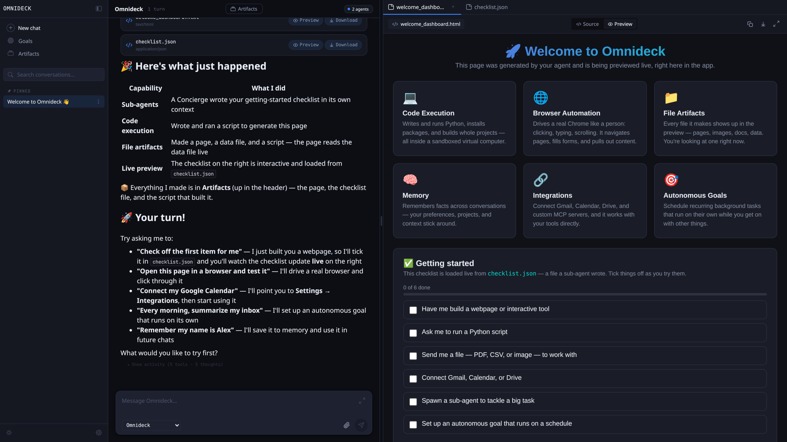

# COMPUTRON

A self-hosted agentic workbench in a single container. Bring your own LLMs — securely-brokered cloud providers (OpenAI, Anthropic, OpenRouter, any OpenAI-compatible endpoint) or local Ollama models — and connect the integrations your agents need (Gmail, Calendar, Drive, custom MCP servers). Agents browse the web, write and run code, and control a Linux desktop. Everything runs on your hardware.



## Prerequisites

- [Docker](https://docs.docker.com/get-docker/)
- An LLM provider — a cloud account (OpenAI, Anthropic, OpenRouter, or any OpenAI-compatible endpoint) or [Ollama](https://ollama.com/) for local models

The setup wizard walks you through adding a provider and picking your main model (used for chat, compaction, and titles) plus an optional vision model on first launch. Cloud providers list their models automatically; Ollama lists whatever you've pulled.

## Try It Out

**Linux (Docker / rootful Podman):**

```bash
docker run -d --name computron --shm-size=256m --network=host \
  ghcr.io/lefoulkrod/computron_9000:latest
```

**Docker Desktop (macOS / Windows / WSL2):**

*bash (macOS / Linux / WSL2):*

```bash
docker run -d --name computron --shm-size=256m \
  -p 8080:8080 \
  --add-host=host.docker.internal:host-gateway \
  -e LLM_HOST=http://host.docker.internal:11434 \
  ghcr.io/lefoulkrod/computron_9000:latest
```

*PowerShell (Windows):*

```powershell
docker run -d --name computron --shm-size=256m `
  -p 8080:8080 `
  --add-host=host.docker.internal:host-gateway `
  -e LLM_HOST=http://host.docker.internal:11434 `
  ghcr.io/lefoulkrod/computron_9000:latest
```

> Docker Desktop also requires Ollama to be bound to `0.0.0.0` (it defaults to `127.0.0.1` on every platform, which the container can't reach). Set `OLLAMA_HOST=0.0.0.0` in Ollama's environment and restart it. Heads up: this exposes Ollama on your LAN — firewall it if that's a concern.

Open **[http://localhost:8080](http://localhost:8080)**. The setup wizard walks you through picking your main model and vision model on first launch.

Data won't persist when the container is removed. When you're ready to keep it, add volumes:

### Keep Your Data

**Linux:**

```bash
docker run -d --name computron --shm-size=256m --network=host \
  -v computron_home:/home/computron \
  -v computron_state:/var/lib/computron \
  ghcr.io/lefoulkrod/computron_9000:latest
```

**Docker Desktop:**

*bash (macOS / Linux / WSL2):*

```bash
docker run -d --name computron --shm-size=256m \
  -p 8080:8080 \
  --add-host=host.docker.internal:host-gateway \
  -e LLM_HOST=http://host.docker.internal:11434 \
  -v computron_home:/home/computron \
  -v computron_state:/var/lib/computron \
  ghcr.io/lefoulkrod/computron_9000:latest
```

*PowerShell (Windows):*

```powershell
docker run -d --name computron --shm-size=256m `
  -p 8080:8080 `
  --add-host=host.docker.internal:host-gateway `
  -e LLM_HOST=http://host.docker.internal:11434 `
  -v computron_home:/home/computron `
  -v computron_state:/var/lib/computron `
  ghcr.io/lefoulkrod/computron_9000:latest
```

Conversations, memory, custom tools, agent profiles, and generated files now survive restarts.

### Using Ollama for Local Models

If you'd rather run models locally than use a cloud provider, install [Ollama](https://ollama.com/) on the host and pull at least one model. The setup wizard lists whatever you've pulled.

```bash
ollama pull kimi-k2.5    # main model
ollama pull qwen3.5      # vision model
```

| Role | Suggested | Notes |
|------|-----------|-------|
| Main | `kimi-k2.5` | Also used for compaction (context summarization) and title generation |
| Vision | `qwen3.5` | Must support image input — or use your main model if it does |

**Ollama cloud models** — Ollama can broker cloud-hosted variants alongside your local models so they show up the same way in the app. After `ollama login`, pull a cloud variant:

```bash
ollama pull kimi-k2.5:cloud
```

Cloud variants skip your local GPU but still need to be pulled so Ollama exposes them.

### Enable GPU Features

Image generation, music generation, and visual grounding are **disabled by default**. They require an NVIDIA GPU and are enabled individually via environment variables:

| Feature | Env Var | Requires |
|---------|---------|----------|
| Image generation | `ENABLE_IMAGE_GEN=1` | GPU + `HF_TOKEN` |
| Music generation | `ENABLE_MUSIC_GEN=1` | GPU |
| Visual grounding | `ENABLE_GROUNDING=1` | GPU |

Example with image and music generation enabled:

**Linux:**

```bash
docker run -d --name computron --shm-size=256m --network=host \
  --gpus all \
  -e HF_TOKEN=hf_your_token_here \
  -e ENABLE_IMAGE_GEN=1 \
  -e ENABLE_MUSIC_GEN=1 \
  -v computron_home:/home/computron \
  -v computron_state:/var/lib/computron \
  ghcr.io/lefoulkrod/computron_9000:latest
```

**Docker Desktop (Windows + WSL2):**

*bash (WSL2):*

```bash
docker run -d --name computron --shm-size=256m \
  -p 8080:8080 \
  --add-host=host.docker.internal:host-gateway \
  --gpus all \
  -e LLM_HOST=http://host.docker.internal:11434 \
  -e HF_TOKEN=hf_your_token_here \
  -e ENABLE_IMAGE_GEN=1 \
  -e ENABLE_MUSIC_GEN=1 \
  -v computron_home:/home/computron \
  -v computron_state:/var/lib/computron \
  ghcr.io/lefoulkrod/computron_9000:latest
```

*PowerShell (Windows):*

```powershell
docker run -d --name computron --shm-size=256m `
  -p 8080:8080 `
  --add-host=host.docker.internal:host-gateway `
  --gpus all `
  -e LLM_HOST=http://host.docker.internal:11434 `
  -e HF_TOKEN=hf_your_token_here `
  -e ENABLE_IMAGE_GEN=1 `
  -e ENABLE_MUSIC_GEN=1 `
  -v computron_home:/home/computron `
  -v computron_state:/var/lib/computron `
  ghcr.io/lefoulkrod/computron_9000:latest
```

Requires [NVIDIA Container Toolkit](https://docs.nvidia.com/datacenter/cloud-native/container-toolkit/latest/install-guide.html). See [GPU Setup](#gpu-setup) for install steps. (macOS isn't supported for GPU features.)

### Experimental Features

These features are disabled by default and may change or be removed in future versions.

| Feature | Env Var | Description |
|---------|---------|-------------|
| Desktop agent | `ENABLE_DESKTOP=1` | GUI automation — the agent can see and interact with a full Linux desktop (Xfce4) via mouse and keyboard. Works best with GPU and `ENABLE_GROUNDING=1` for precise visual targeting. |

The desktop agent exposes VNC on `5900` (native viewer) and noVNC on `6080` (browser viewer at `http://localhost:6080/vnc.html`).

**Linux:**

```bash
docker run -d --name computron --shm-size=256m --network=host \
  --gpus all \
  -e ENABLE_DESKTOP=1 \
  -e ENABLE_GROUNDING=1 \
  -v computron_home:/home/computron \
  -v computron_state:/var/lib/computron \
  ghcr.io/lefoulkrod/computron_9000:latest
```

**Docker Desktop (Windows + WSL2):**

*bash (WSL2):*

```bash
docker run -d --name computron --shm-size=256m \
  -p 8080:8080 -p 5900:5900 -p 6080:6080 \
  --add-host=host.docker.internal:host-gateway \
  --gpus all \
  -e LLM_HOST=http://host.docker.internal:11434 \
  -e ENABLE_DESKTOP=1 \
  -e ENABLE_GROUNDING=1 \
  -v computron_home:/home/computron \
  -v computron_state:/var/lib/computron \
  ghcr.io/lefoulkrod/computron_9000:latest
```

*PowerShell (Windows):*

```powershell
docker run -d --name computron --shm-size=256m `
  -p 8080:8080 -p 5900:5900 -p 6080:6080 `
  --add-host=host.docker.internal:host-gateway `
  --gpus all `
  -e LLM_HOST=http://host.docker.internal:11434 `
  -e ENABLE_DESKTOP=1 `
  -e ENABLE_GROUNDING=1 `
  -v computron_home:/home/computron `
  -v computron_state:/var/lib/computron `
  ghcr.io/lefoulkrod/computron_9000:latest
```

---

## Features

- **Chat** — talk to the agent, ask it to do things
- **Agent Profiles** — reusable configurations bundling model, system prompt, skills, and inference parameters. Ship with 4 defaults, create your own in Settings.
- **Browser automation** — controls Chrome with human-like clicking, typing, and scrolling
- **Desktop control** — sees and interacts with the full Linux desktop via screenshots and accessibility tree
- **Code execution** — writes and runs Python, installs packages, builds projects
- **Custom tools** — the agent can write its own tools and reuse them across sessions
- **Autonomous tasks** — schedule recurring goals that run in the background (with optional Telegram notifications)
- **Memory** — persistent memory across conversations

### GPU Features (optional)

These require an NVIDIA GPU, the NVIDIA Container Toolkit, and some extra setup. Models download automatically on first use.

**Image Generation** — 1024x1024 images using FLUX.1. Two modes: "fast" (4 steps, ~10s) and "quality" (20 steps, ~30s). Requires 8-10 GB VRAM and a free [HuggingFace token](https://huggingface.co/settings/tokens) (FLUX is a gated model). First download: ~58 GB.

**Music Generation** — full tracks with vocals using ACE-Step 1.5. Style presets (pop, rock, electronic, jazz, etc.), custom lyrics, up to 10 minutes. Requires ~10 GB VRAM. First download: ~8 GB.

**Desktop Visual Grounding** — the agent looks at a screenshot and clicks specific UI elements using the UI-TARS vision model. Powers the desktop agent's ability to interact with any application. Requires ~15 GB VRAM. First download: ~33 GB.

---

## GPU Setup

Skip this section if you don't need image/music generation.

### Platform Support

- **Linux** (x86_64) — fully supported
- **Windows** — works via WSL2 + Docker Desktop (with NVIDIA GPU passthrough)
- **macOS** — not supported

### Prerequisites

1. **NVIDIA GPU + drivers**
2. **Docker or Podman (rootful)**
3. **[NVIDIA Container Toolkit](https://docs.nvidia.com/datacenter/cloud-native/container-toolkit/latest/install-guide.html)**
4. **[Ollama](https://ollama.com/)** running on the host
5. **[HuggingFace token](https://huggingface.co/settings/tokens)** (optional, for FLUX.1 image generation)

### Linux

```bash
# 1. Install Docker
curl -fsSL https://get.docker.com | sh
sudo systemctl enable --now docker

# 2. Install NVIDIA Container Toolkit
curl -fsSL https://nvidia.github.io/libnvidia-container/gpgkey \
  | sudo gpg --dearmor -o /usr/share/keyrings/nvidia-container-toolkit-keyring.gpg
curl -s -L https://nvidia.github.io/libnvidia-container/stable/deb/nvidia-container-toolkit.list \
  | sed 's#deb https://#deb [signed-by=/usr/share/keyrings/nvidia-container-toolkit-keyring.gpg] https://#g' \
  | sudo tee /etc/apt/sources.list.d/nvidia-container-toolkit.list
sudo apt-get update && sudo apt-get install -y nvidia-container-toolkit
sudo nvidia-ctk runtime configure --runtime=docker
sudo systemctl restart docker

# 3. Install Ollama
curl -fsSL https://ollama.ai/install.sh | sh

# 4. Pull a main model and a vision model
ollama pull kimi-k2.5
ollama pull qwen3.5
```

### Windows (WSL2)

```powershell
# 1. Install WSL2 with Ubuntu
wsl --install -d Ubuntu

# 2. Install Docker Desktop with WSL2 backend
#    https://docs.docker.com/desktop/install/windows-install/
#    Enable: Settings > Resources > WSL Integration > Ubuntu

# 3. Install NVIDIA drivers for WSL2
#    https://developer.nvidia.com/cuda/wsl
#    Install the Windows NVIDIA driver (not the Linux one inside WSL)

# Then inside WSL2 (Ubuntu terminal):
# 4. Install NVIDIA Container Toolkit (same as Linux steps above)

# 5. Install Ollama inside WSL2
curl -fsSL https://ollama.ai/install.sh | sh

# 6. Pull a main model and a vision model
ollama pull kimi-k2.5
ollama pull qwen3.5
```

### Running with GPU

**Docker:**

```bash
docker run -d --rm \
  --name computron \
  --gpus all \
  --shm-size=256m \
  --network=host \
  -e HF_TOKEN=hf_your_token_here \
  -e ENABLE_IMAGE_GEN=1 \
  -e ENABLE_MUSIC_GEN=1 \
  -v computron_home:/home/computron \
  -v computron_state:/var/lib/computron \
  ghcr.io/lefoulkrod/computron_9000:latest
```

**Podman (rootful):**

```bash
sudo podman run -d --rm \
  --name computron \
  --device nvidia.com/gpu=all \
  --shm-size=256m \
  --network=host \
  -e HF_TOKEN=hf_your_token_here \
  -e ENABLE_IMAGE_GEN=1 \
  -e ENABLE_MUSIC_GEN=1 \
  -v computron_home:/home/computron:rw \
  -v computron_state:/var/lib/computron:rw \
  ghcr.io/lefoulkrod/computron_9000:latest
```

Then open **[http://localhost:8080](http://localhost:8080)**.

---

## Reference

### Environment Variables

Pass these with `-e` when running the container:

| Variable | Required | Purpose |
|----------|----------|---------|
| `LLM_HOST` | No | Ollama URL. Defaults to `http://localhost:11434` — works as-is with `--network=host`. On Docker Desktop, set to `http://host.docker.internal:11434` and pass `--add-host=host.docker.internal:host-gateway`. |
| `HF_TOKEN` | For image gen | HuggingFace token. Required for FLUX.1 (gated model). |
| `ENABLE_IMAGE_GEN` | No | Set to `1` to enable image generation (requires GPU + HF_TOKEN). |
| `ENABLE_MUSIC_GEN` | No | Set to `1` to enable music generation (requires GPU). |
| `ENABLE_DESKTOP` | No | Set to `1` to enable the desktop agent (GUI automation via Xfce). |
| `ENABLE_GROUNDING` | No | Set to `1` to enable visual grounding in browser/desktop (requires GPU). |

Telegram bot setup (both bidirectional chat and goal-run push notifications)
is configured in-app: add a Telegram integration on the Integrations tab,
then wire push notifications to it from Settings → System → Notifications.

To pass multiple env vars, add `-e` for each one:

```bash
docker run -d --name computron --shm-size=256m --network=host \
  -e HF_TOKEN=hf_your_token_here \
  -v computron_home:/home/computron \
  -v computron_state:/var/lib/computron \
  ghcr.io/lefoulkrod/computron_9000:latest
```

### Ports

With `--network=host` (the Quick Start default on Linux), these ports are exposed directly on your machine:

| Port | Service | Notes |
|------|---------|-------|
| 8080 | Web UI | Configurable via `-e PORT=...` |
| 5900 | VNC (connect with any VNC viewer to watch the agent's desktop) | Only useful with `ENABLE_DESKTOP=1` |
| 6080 | noVNC (browser-based VNC at `http://localhost:6080/vnc.html`) | Only useful with `ENABLE_DESKTOP=1` |

> **On Docker Desktop**, drop `--network=host` and publish each port explicitly: `-p 8080:8080` for the UI, plus `-p 5900:5900 -p 6080:6080` if `ENABLE_DESKTOP=1`.

### Data Persistence

Named volumes survive container restarts and upgrades:

| Volume | Contents |
|--------|----------|
| `computron_home` | Agent workspace, downloads, generated media, model cache |
| `computron_state` | Conversations, memory, custom tools, agent profiles, goals |

To start fresh: `docker volume rm computron_home computron_state`

### Ollama Models

These run on your host Ollama instance. The setup wizard helps you pick models on first launch. You can change them later in Settings > System.

| Role | Tested With | What It Does |
|------|------------|--------------|
| Main | `kimi-k2.5` | Chat, code generation, autonomous tasks, and context summarization |
| Vision | `qwen3.5` | Image descriptions and screenshot analysis |

### GPU Models

Download automatically on first use. Cached in the `computron_home` volume.

| Model | Task | Download | VRAM |
|-------|------|----------|------|
| [FLUX.1-schnell](https://huggingface.co/black-forest-labs/FLUX.1-schnell) | Fast image gen | ~58 GB | ~8 GB |
| [FLUX.1-dev](https://huggingface.co/black-forest-labs/FLUX.1-dev) | Quality image gen | ~58 GB | ~10 GB |
| [ACE-Step 1.5](https://github.com/ace-step/ACE-Step-1.5) | Music generation | ~8 GB | ~10 GB |
| [UI-TARS 1.5 7B](https://huggingface.co/ByteDance-Seed/UI-TARS-1.5-7B) | Desktop grounding | ~33 GB | ~15 GB |

### VRAM Guide

GPU models load on demand and unload after idle timeout to free VRAM. Only one generation model is loaded at a time — if you generate an image then generate music, the image model unloads first. Models also use CPU offload automatically when VRAM is tight.

| Use Case | VRAM Needed |
|----------|-------------|
| Chat only (Ollama cloud models) | 0 GB |
| Chat + local Ollama (e.g. kimi-k2.5) | 24 GB |
| Image generation | 8-10 GB |
| Music generation | ~10 GB |
| Desktop grounding | ~15 GB |

These are independent — you don't need to add them up. The author runs all features on 4 GPUs (84 GB total), but a single 12 GB GPU handles image and music generation fine.

### Stopping

```bash
docker stop computron        # Docker
sudo podman stop computron   # Podman
```

### Upgrading

Pull the latest image, replace the old container, then re-run your original `docker run …` command. Named volumes (`computron_home`, `computron_state`) preserve your data, and schema migrations run automatically on startup.

```bash
docker pull ghcr.io/lefoulkrod/computron_9000:latest
docker stop computron && docker rm computron
# re-run your original `docker run …` from "Try It Out"
```

(Podman: `sudo podman pull / stop / rm`.)

## Troubleshooting

**"Cannot access gated repo"** — Set `HF_TOKEN` and accept the model license at [huggingface.co/black-forest-labs/FLUX.1-schnell](https://huggingface.co/black-forest-labs/FLUX.1-schnell).

**UI doesn't load** — Wait 10-15 seconds for startup. Check logs: `docker logs -f computron`.

**"Ollama connection refused"** — On Linux with `--network=host`, just make sure Ollama is running on the host. On Docker Desktop, you need `--add-host=host.docker.internal:host-gateway` + `-e LLM_HOST=http://host.docker.internal:11434`, AND Ollama bound to `0.0.0.0` (set `OLLAMA_HOST=0.0.0.0` and restart it — it defaults to `127.0.0.1` everywhere).

**No GPU detected** — Install the NVIDIA Container Toolkit and pass `--gpus all` (Docker) or `--device nvidia.com/gpu=all` (Podman).

**VNC blank screen** — Desktop takes a few seconds. Check `docker logs computron` for errors.

## Building from Source

```bash
git clone <repo-url> computron_9000
cd computron_9000
docker build -f container/Dockerfile -t computron_9000:latest .
```

Then run with the same commands above, replacing `ghcr.io/lefoulkrod/computron_9000:latest` with `computron_9000:latest`.

See [DEVELOPMENT.md](DEVELOPMENT.md) for the dev workflow.
