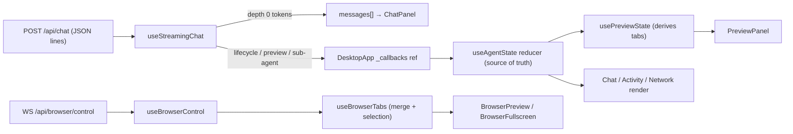
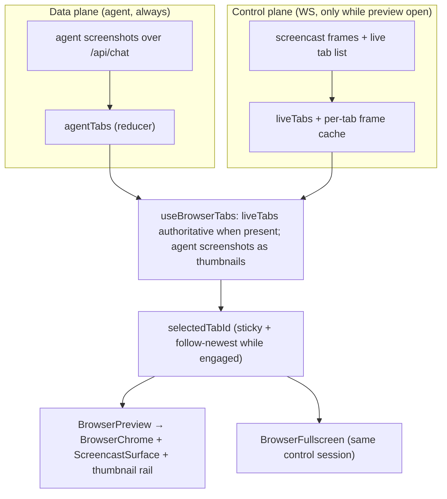

# UI Architecture

React 18 + Vite, CSS Modules, desktop-only (no mobile shell). Grouped by
subsystem. Source root: `server/ui/src/`.

---

## 1. Big picture

`main.jsx` mounts a small provider stack and the app:
`ToastProvider → AppDataProvider → App`. `App.jsx` owns only theme state and
renders `DesktopApp`, which wraps `DesktopAppInner` in `AgentStateProvider`. The
wrapper exists solely so the inner component can *consume* the agent-state context
its parent *provides*.

`DesktopAppInner` is the orchestrator for everything below: the shell & views
(§2), state & streaming (§3), chat (§4), network/activity (§5), preview (§6)
including browser takeover (§7), and settings/routines (§8).

Two **independent real-time channels** feed the UI:

- **Chat / agent / preview** — newline-delimited JSON streamed over
  `POST fetch('/api/chat')`, read with a `ReadableStream` reader (not SSE),
  routed by `useStreamingChat`.
- **Browser takeover** — a **WebSocket** to `/api/browser/control`, owned by
  `useBrowserControl` (CDP screencast out, input primitives in).

---

## 2. Shell & views

The shell is a left **`Sidebar`** (nav, OMNIDECK wordmark, theme toggle, audio,
new-chat, recent conversations) plus a main area that shows **exactly one** view,
and an optional preview column on the right.

`view ∈ {chat, settings, routines, network}`:

- **Chat** (`ChatPanel`) — default; always mounted, hidden via CSS when another
  view is active so scroll/input state survive.
- **Network** — `AgentNetwork` (no agent selected) or `AgentActivityView` (an
  agent is drilled into).
- **Routines** (`RoutinesView`) and **Settings** (`SettingsPage`) — full width.

The preview column (a `SplitHandle` + `PreviewPanel`) shows only alongside Chat or
Activity, gated by
`hasPreview = preview.tabs.length>0 && (view==='chat' || (view==='network' && selectedAgentId))`.
There is no standalone Header component — per-view title bars carry the chrome;
`--header-height` / `--sidebar-width` are layout tokens. Fullscreen file/browser
overlays and the user-desktop overlay float above everything (`position: fixed`).

---

## 3. State & data flow

State is one reducer plus a few focused hooks. The diagram earns its place here
because two inbound channels converge into shared state:



### Agent state & context (`hooks/useAgentState.jsx`)

One `useReducer` is the **single source of truth for both agent and preview
data** — the preview panel is entirely *derived* from it by `usePreviewState`
(which stores no preview content of its own). It's exposed through **two separate
contexts** so reads and writes don't couple:

- `AgentStateProvider` (wraps the app inside `DesktopApp`) runs the reducer and
  provides `AgentStateContext` (the state) and `AgentDispatchContext` (the
  `dispatch` fn) independently.
- `useAgentState()` reads state; `useAgentDispatch()` gets dispatch. Both throw
  if used outside the provider. The split means a component that only dispatches
  doesn't re-render when the state changes (and vice versa).

Top-level state:

```
agents: { [id]: AgentNode }   // every agent in the tree, keyed by id
rootId                        // the latest turn's root agent
selectedAgentId               // the card drilled into (or null)
networkActivated              // latches true once any sub-agent appears
```

Each `AgentNode`:

```
id, name, parentId, correlationId   // correlationId ties a sub-agent to the
                                    //   parent's spawn_requested activity entry
status (running|success|error|stopped), childIds[], startedAt, completedAt
activityLog[]                       // thinking, content, tool calls, file outputs
browserTabs { [tabId]: {url,title,screenshot} }, lastBrowserTabId
terminalLines[] (capped 50), desktopActive, generationPreview, openFiles[]
activeTool, iteration, maxIterations, contextUsage
```

Data flows in one direction — backend stream → `useStreamingChat` → `DesktopApp`
`_callbacks` → `dispatch`. The reducer actions:

| Action | Effect |
|---|---|
| `AGENT_STARTED` | create the node and link it under its parent (`childIds`). A parent-less start is a new turn → it becomes `rootId`, clears `selectedAgentId`, and **carries preview state over from the previous root** so panels don't blink between turns |
| `AGENT_COMPLETED` | set `status` + `completedAt`, clear `activeTool` |
| `APPEND_STREAM_CHUNK` | merge streamed thinking/content into `activityLog` (extends the last entry when the type matches) |
| `APPEND_ACTIVITY` | append a one-off entry (tool call, file output, spawn) |
| `UPDATE_BROWSER_SNAPSHOT` | upsert a per-tab snapshot and reconcile against the open-tab id set (prune closed tabs); a screenshot-less event is reconcile-only |
| `UPDATE_TERMINAL` · `UPDATE_GENERATION_PREVIEW` · `UPDATE_DESKTOP_ACTIVE` · `UPDATE_ACTIVE_TOOL` · `UPDATE_ITERATION` | per-mode preview + status updates |
| `OPEN_FILE` / `CLOSE_FILE` | add/remove a file preview tab (dedup by filename) |
| `SELECT_AGENT` | drill into a card (`selectedAgentId`) |
| `CLEAR_BROWSER_TABS` / `CLEAR_TERMINAL` | clear a mode |
| `RESET` | back to empty — new conversation |

Invariants: each turn mints a **fresh root id** (`rootId` follows the latest),
`networkActivated` clears only on `RESET`, and a new root inherits the previous
root's preview data.

### Hooks & contexts

| Hook / context | Kind | Owns |
|---|---|---|
| `useAgentState` / `useAgentDispatch` | context + reducer | the agent tree — source of truth for agent + preview data (read vs dispatch split; see above) |
| `useStreamingChat` | hook | `/api/chat` stream loop, `messages[]`, `isStreaming`, send/stop/load/new/nudge |
| `usePreviewState` | hook | preview tabs, `activeTab`, `splitPosition`, `fullscreenItem`, `openFile`/`reset` |
| `useBrowserTabs` | hook | merge `liveTabs` + agent screenshots; selection |
| `useBrowserControl` | hook | the browser-control WebSocket (screencast, input, engage, per-tab frame cache) |
| `useRoutines` | hook | routines + runner polling/CRUD |
| `useFileContent` | hook | decode/watch a previewed file; source/preview toggle |
| `useAutoScroll` | hook | stick-to-bottom for chat/activity |
| `useAppData` | context | `{ profilesHook, features }` — profiles store + feature flags, shared once |
| `useToast` | context | toast queue |

---

## 4. Chat subsystem

- **`ChatPanel`** — title bar (title, context meter, network pill); holds:
  - **`ChatMessages`** (auto-scroll) — renders **`StarterPrompts`** when empty,
    else a list of **`Message`**.
    - **`Message`** filters entries (inline: content / file / spawn; hidden:
      thinking / tool calls) and renders **`AgentOutput`**.
      - **`AgentOutput`** — ordered entry renderer: `CollapsibleThinking`,
        `MarkdownContent`/`CodeBlock`, `ToolCallBlock`, `FileOutput` (opens a
        preview tab), `SpawnCard`.
  - **`ChatInput`** — textarea, `ProfileSelector`, send/nudge/stop, attachment.

`AgentOutput` is shared with the Activity view, which renders it **unfiltered**
(thinking + tool calls included).

---

## 5. Agent network / activity

- **`AgentNetwork`** — visualizes the tree of agents that have children; each
  node is an **`AgentCard`** (status, elapsed, active tool, context fill,
  thumbnail). Selecting a card sets `selectedAgentId`.
- **`AgentActivityView`** — one agent's detail: breadcrumb + meta bar, an
  **`ActivityRail`** (the unfiltered `AgentOutput` stream), and a nudge bar to
  message a still-running agent.

When an agent is selected the preview column follows it (`usePreviewState`).

---

## 6. Preview subsystem

**`PreviewPanel`** is today only a tab strip + a content slot; `DesktopApp`
renders the mode content (passed as children) and the fullscreen overlay. The
five modes:

- **`BrowserPreview`** — browser takeover (§7).
- **`FilePreview` → `FileContentRenderer`** — code / markdown / HTML / PDF /
  image; `useFileContent` decodes and watches for changes.
- **`TerminalPanel`** — command output (the 50-line-capped `terminalLines`).
- **`DesktopPreview`** — a noVNC iframe (also reused as the user-desktop overlay).
- **`GenerationPreview`** — media-generation progress + output.

Fullscreen is the same components in a viewport-filling overlay
(`FilePreview fullscreen`, `BrowserFullscreen`), all `position: fixed; inset: 0`,
so they're DOM-ancestor-independent and can move into a child without CSS
breakage.

---

## 7. Browser preview & takeover

The trickiest seam. Tab state has **two sources** covering complementary windows,
reconciled in `useBrowserTabs` — a diagram helps because two planes converge:



The planes barely overlap by design (agent-silent-during-takeover → control;
preview-closed → data) and carry different payloads (PNG screenshots vs live JPEG
frames). Invariants worth knowing before editing:

- Only the **foreground** tab can be `captureScreenshot`'d (headed Chromium); an
  agent action foregrounds the tab it touches, so the shot-after-action lands.
- The **screencast and input both survive backgrounding** — pinned to the
  selected page — so the live view/takeover work regardless of foreground.
- `engaged` is gated by `canControl = !isStreaming`: a starting turn
  force-disengages, so the agent and human never drive at the same instant.
- `ScreencastSurface` renders unconditionally (the `` is the conditional
  child) so a momentary empty frame can't unmount it and drop input/focus.

---

## 8. Settings, Routines, Integrations

- **`SettingsPage`** — a flat tab bar: Profiles, Skills, Providers, Integrations,
  Memory, Custom Tools, System. Each tab owns its data via a dedicated hook
  (`useAgentProfiles`, `useSkills`, …) and is feature-gated via
  `useAppData().features`.
- **`RoutinesView`** — split screen: `RoutinesListPanel` (left) and a drill-down on the
  right (`RoutineView → RunDetail → TaskDetail → TaskOutputModal`).

---

## 9. Design system

SIGNAL design language. **Note:** the spec lives at
`docs/design/design_language.html` (HTML, not `.md`) and is still titled
"COMPUTRON 9000" — stale vs the current "OMNIDECK" identity.

- **CSS Modules** — ~70 `*.module.css`, one per component; the only global sheets
  are `global.css` (tokens + a minimal reset) and `hljs-tokens.css`.
- **Tokens** — defined in `global.css` `:root` (light = "Blueprint") and
  overridden under `[data-theme="dark"]` (dark = "Terminal"). Families: surfaces
  (`--canvas/--surface/--elevated`), text, borders, `--accent*`, status, shadows,
  a separate **terminal/code** token set (`--terminal-*`, `--code-*`), and
  layout/radius/spacing/z-index/easing scales. Components reference `var(--…)`,
  not raw colors (a handful of `#000`/`#fff` remain for media letterboxing and
  text-on-accent — candidates for a `--text-on-accent` token).
- **Theme switching** — `App.jsx` seeds from `prefers-color-scheme` and sets
  `data-theme` on `<html>`; the CSS cascade recomputes every token, so no
  component re-renders for a theme change.
- **Typography (diverged from the spec)** — `--font-brand` is **`Roboto Mono`**
  (labels, agent names, breadcrumbs, status), `--font-body` is `system-ui`
  (prose), `--font-code` is `JetBrains Mono` (code/terminal). `Share Tech Mono`
  is **imported in `global.css` but unused** — the design doc calls for it but
  production uses Roboto Mono.
</content>
