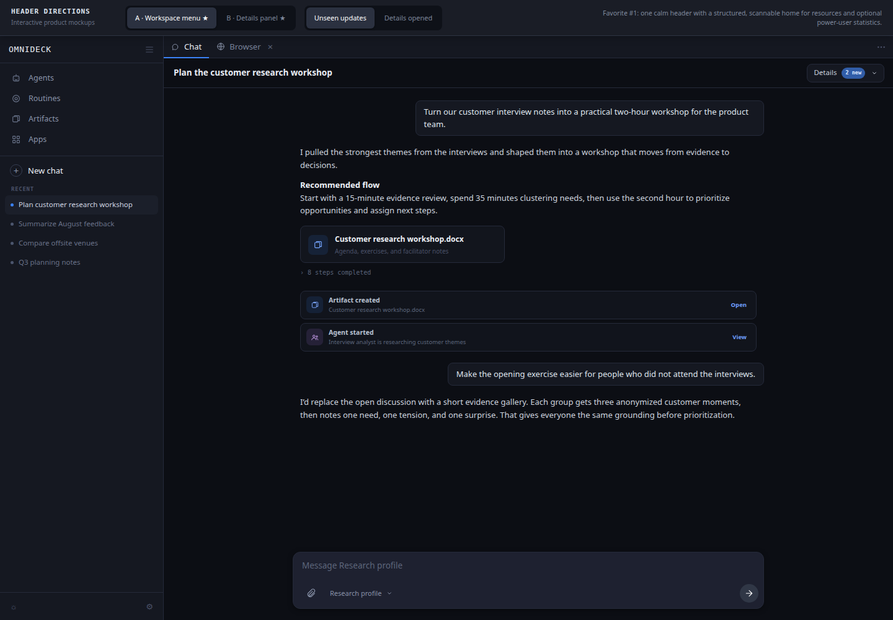
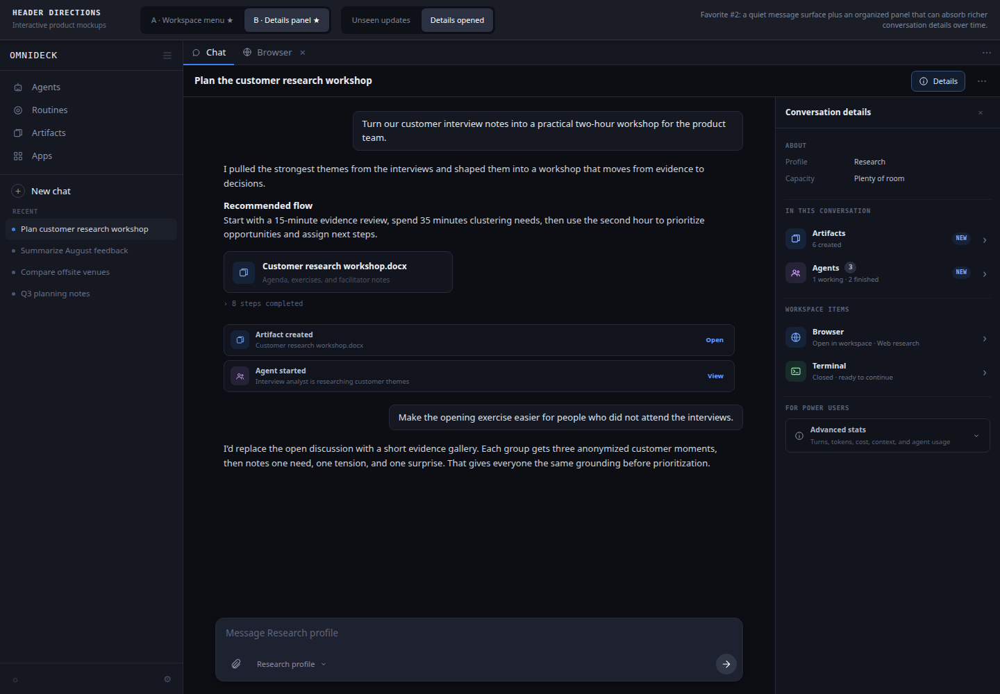
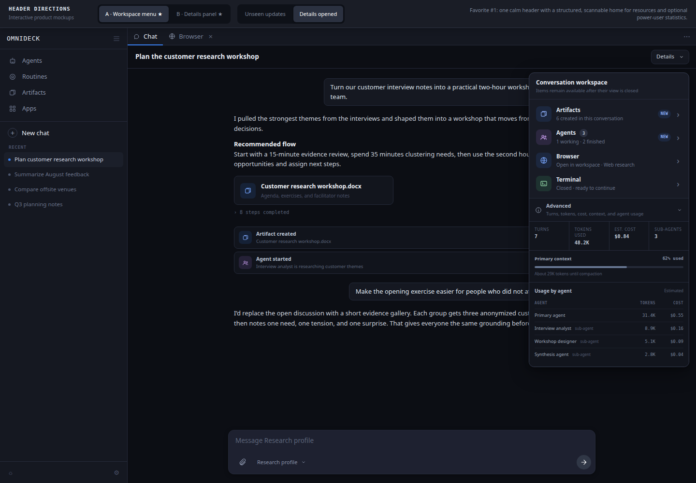

# Conversation header options

Open [`index.html`](./index.html) to compare two interactive directions inside a realistic omnideck conversation. Direct links use `?option=a` or `b`; add `&state=unseen` or `&state=opened` to compare notification states.

## Quick preview

| A · Workspace menu ★ | B · Details panel ★ |
| --- | --- |
|  |  |

## Current directions

**A · Workspace menu** remains the leading option, with a **Details** trigger in the product UI. It restores a clear visual hierarchy—conversation identity first, conversation workspace second—without permanently consuming more height. Artifacts, Agents, Browser, and Terminal have one durable home, even after a view is closed. The current sketch shows the Browser open as a background workspace tab and the Terminal closed but available to reopen.

**B · Details panel** is the second favorite. It keeps the message surface quiet while providing the most natural place for richer metadata. If conversation-level settings, provenance, permissions, or billing controls arrive later, this model has the most room to absorb them cleanly.

Neither puts capacity, turn count, tokens, or cost in the permanent header. Exact usage and future diagnostic statistics move into an expandable **Advanced stats** section for people who need them; the Details panel may also carry a quiet capacity fact when it is relevant.

## Comparison

| Option | IA model | Closed Browser / Terminal | Strength | Cost |
| --- | --- | --- | --- | --- |
| **A · Workspace menu ★** | One compact disclosure groups conversation resources; a separate Advanced disclosure holds statistics | The supporting text distinguishes open from closed; every row uses the same chevron affordance | Calm, coherent, and extensible | Resource state takes one click to inspect |
| **B · Details panel ★** | Identity stays in the header; capacity, resources, and metadata move to a structured side panel | Open and closed views are grouped under **Workspace items**, with consistent row navigation | Strongest long-term metadata capacity | Uses horizontal space and adds a reveal action |

## Revised language and hierarchy

The proposals separate four kinds of information:

1. **Identity** — the conversation title answers “where am I?” and remains first.
2. **Conversation resources** — **Artifacts**, **Agents**, **Browser**, and **Terminal** are one family. Browser and Terminal distinguish **Open in workspace** from **Closed · ready to continue**. Every row is selected the same way; the product decides whether to focus, open, or reopen the destination. Supporting copy can describe the Browser's purpose, such as “Web research.”
3. **Advanced stats** — turns, total tokens, estimated cost, sub-agent count, and future diagnostics are available on demand rather than competing with the title. Primary-context usage shows proximity to compaction; token usage and estimated cost are broken down by the primary agent and each spawned agent. Sub-agent capacity is intentionally omitted.

The mockups use **Artifacts**, not Files. They use **Agents** with a scoped count and supporting copy such as “1 working · 2 finished,” preserving the product concept without renaming agents according to the task they happened to perform.

Closing a Browser or Terminal view changes only its presentation state. The resource remains attached to the conversation and discoverable until the user explicitly removes its history.

The UI derives this without maintaining a fragile extra “closed” flag: the resource catalog says that an item exists, while the Desktop view catalog says whether its deterministic view ID is currently open. An available resource absent from the Desktop catalog is therefore reopenable. “New” remains a separate notification state.

## Discoverability model

New resources are announced at three levels without turning the header into a permanent dashboard:

1. A compact transcript event records **Artifact created** or **Agent started** where it happened.
2. The closed trigger reads **Details · 2 new**, where the number means unseen updates—not the total number of resources.
3. Opening Details clears the aggregate badge and marks the specific Artifacts and Agents rows as **New**. Durable state such as **1 working · 2 finished** remains after the notification is acknowledged.

| Before opening Details | After opening Details |
| --- | --- |
|  |  |

## Inspiration and evidence

- [Linear view sidebars](https://linear.app/docs/custom-views) put clarifying properties in a right-hand panel instead of crowding the primary content. [Notion database layouts](https://www.notion.com/en-gb/help/layouts?nxtPslug=layouts) similarly group, hide, and move properties between the heading and details panel. Together they support option B and the separation of essential versus advanced facts.
- [Chrome history](https://support.google.com/chrome/answer/95589) supports resuming prior browsing activity instead of requiring every page to remain open. That recovery model informs **Ready to reopen** in both options.
- [Apple’s toolbar guidance](https://developer.apple.com/design/human-interface-guidelines/toolbars?changes=_2) recommends a useful, concise title, logical control groups, and deliberately limited toolbar items. This is why both options keep turns, tokens, and cost out of the permanent row.
- [WAI’s disclosure pattern](https://www.w3.org/WAI/ARIA/apg/patterns/disclosure/) provides the accessible interaction model for the Workspace and Advanced sections: named buttons, explicit expanded state, and keyboard activation.
- [VS Code’s interface model](https://code.visualstudio.com/docs/editing/userinterface) separates navigation, content, panels, and compact state while preserving prior layout. That separation informs the resource-versus-view distinction shared by both options.

## Suggested validation

Test A and B with representative knowledge workers. After a short conversation task, close the Browser and Terminal views and ask participants to continue the earlier work without coaching. Measure whether they find the resources and whether **Ready to reopen** matches their expectation. Test Advanced stats separately with users who actively monitor token use or cost.
