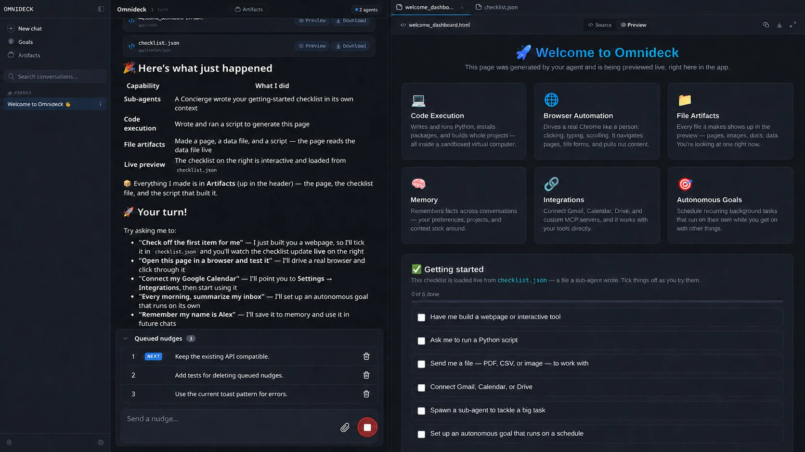
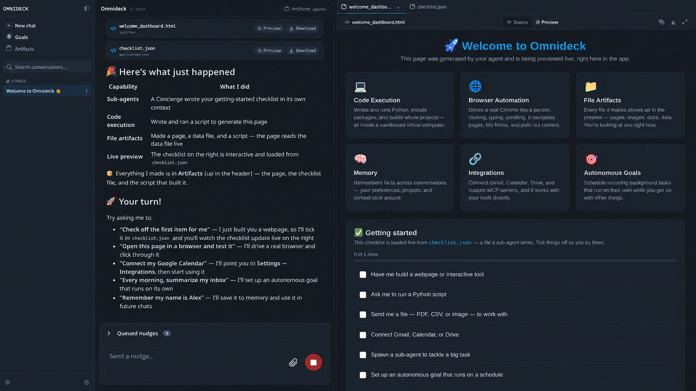

# Queued nudges UI

## Expanded

## Collapsed

## Recommended interaction

- Build the queue and composer as one continuous card with a shared border, radius, and shadow.
- Place the queue disclosure at the top of the composer, separated from its input by a subtle internal divider.
- Let the header collapse the rows into a one-line `Queued nudges` bar while preserving the live count.
- List every pending nudge in send order. Mark the first item as `NEXT`.
- Bind the queue and composer to the currently running agent. Do not expose an agent selector while nudging.
- Keep the agent destination implicit; do not repeat its name in the queue or composer.
- Delete a pending nudge from its row without a confirmation dialog.
- After deletion, show a short-lived `Nudge removed` toast with an `Undo` action.
- Remove a nudge from this panel as soon as it is injected into the agent's context; it then appears in the conversation as the existing inline nudge message.
- Hide the panel when the queue is empty. If it grows beyond five rows, keep the composer fixed and scroll the list.

## Scope assumption

The panel represents pending nudges for the agent whose conversation or activity view is open. Nudging a different agent requires navigating to that agent first, which keeps the destination contextual and prevents accidental retargeting.

## States to cover in implementation

- Empty: no queue panel.
- Pending: ordered rows with delete controls.
- Deleting: disable only the affected row until the server confirms.
- Delete failed: restore the row in its original position and show an error toast.
- Offline or stopping: keep queued nudges visible, but disable both submission and deletion.

## Generation note

The visuals were produced with the built-in image-generation tool using the current OmniDeck desktop screenshot as an edit target. The prompts preserved the existing shell and changed only the streaming composer area to show the expanded and collapsed queue states.
