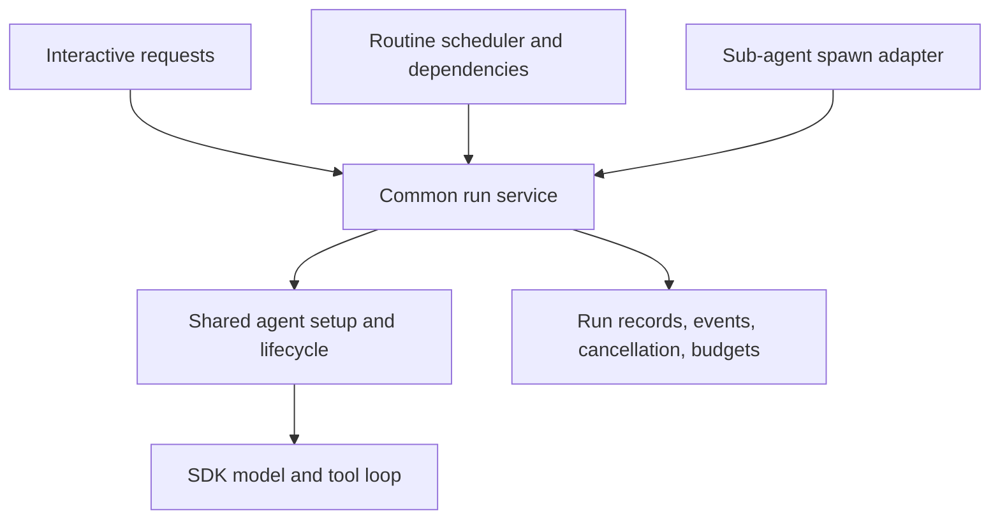

# Agent runtime review — September 5, 2026

The shared SDK tool loop is a useful foundation. The largest improvement would be a common application execution lifecycle used by interactive runs, routine tasks, and sub-agents. Fix lifecycle correctness first, then consolidate those callers incrementally.

Reviewed `origin/main` at `6d02b60d`, fetched September 5, 2026, in a dedicated worktree on `codex/agent-runtime-review-20260905`. The original `main` checkout is at `489426a8` and has diverged; its two local-only commits concern desktop VM testing. This assessment describes the fetched upstream runtime.

I read and followed the parent worktree policy and the repository guide before
starting the review. The parent policy is outside the original checkout's
ancestor chain, so it was explicitly discovered for this request.

**What exists today**

| Entry point | Ownership and execution | Distinct behavior |
| --- | --- | --- |
| Interactive HTTP run | `ActiveRunManager → AgentRunner → run_turn` | Background task independent of subscribers; conversation reservation; active replay cursors; persisted conversation; memory and loaded-skill restoration; browser, terminal, artifact observers. |
| Sub-agent tool | `spawn_agent → run_turn` | Awaited child execution; fresh profile/state/history; nested span; inherited root conversation/event destination and stop signal; returns text. It is not registered with ActiveRunManager. |
| Routine task | `TaskRunner → TaskExecutor → run_turn` | Cron/dependency scheduling; its own concurrency pool and retry behavior; fresh conversation per task execution; event log plus file capture; returns text and file paths. It is not registered with ActiveRunManager. |

Sources: [interactive setup](../agent_runtime/_runner.py#L118),
[child setup](../sdk/tools/_spawn_agent.py#L164),
[routine setup](../tasks/_executor.py#L54), and
[scheduling](../tasks/_runner.py#L105).

Keep the provider normalization, typed events, event-derived model/transcript views, per-agent state, child attribution, browser capability grants, and transport-independent run ownership. The code already shares the central loop; the divergence is in the surrounding execution setup and ownership.

**Priority findings**

1. **P1 — Iteration limits are advisory.** BudgetGuard emits one user-shaped wrap-up prompt, then stops checking. The loop keeps passing the complete tool list and executing calls. A scripted provider with `max_iterations=1` executed three tool rounds and received tools on all four model calls. Enforce limits in execution code; optionally allow one final model call with tools disabled, then return an explicit budget-exhausted outcome. Separate per-agent limits from a root budget shared by descendants. [Guard](../sdk/hooks/_budget_guard.py#L21), [loop](../sdk/turn/_execution.py#L278).

2. **P1 — Stop does not prevent the next queued tool from executing.** StopHook checks around model calls, but neither the tool wrapper nor the executor checks immediately before dispatch. A stop arriving during the first tool in a sequential batch still allows the second tool to run. Check after acquiring the concurrency slot and immediately before calling the tool; make retry waits and long provider waits stop-aware. Record cancellation outcomes for tool calls already announced in the history. [Dispatch](../sdk/turn/_execution.py#L384), [tool invocation](../sdk/tools/_helpers.py#L247), [StopHook](../sdk/hooks/_stop_hook.py#L15).

3. **P1 — Parallel work can outlive its turn.** The loop awaits `asyncio.gather` without ensuring sibling tasks are cancelled or drained when a child raises StopRequestedError or a hook fails. A blocked sibling tool finished after `agent_completed` and `turn_end` in the probe. In the application runner, observers are detached during this unwind, so late events can also miss persistence/delivery. Use a task group or an explicit cancel-and-drain owner, with an intentional policy for recoverable tool errors versus a stop that ends the whole execution. Do not emit a terminal event until all owned work has settled. [Gather](../sdk/turn/_execution.py#L391), [observer cleanup](../agent_runtime/_runner.py#L222).

4. **P1 — Forced cancellation reports success and loses partial output.** `agent_span` starts with status success and catches Exception; CancelledError bypasses that handler. The execution loop also bypasses partial-output recovery on cancellation. A task cancelled after emitting a delta produced `agent_completed(status="success")` and no persistable partial iteration. Handle cancellation explicitly, preserve the partial output, protect scope-token cleanup with nested finally blocks, and propagate a cancelled/interrupted result. Routine cancellation similarly bypasses task-result status updates until startup resets stale work. [Span](../sdk/events/_context.py#L184), [loop unwind](../sdk/turn/_execution.py#L393), [routine status handling](../tasks/_runner.py#L129).

5. **P1 — Routine retries can repeat completed side effects.** TaskRunner retries any Exception by placing the same task result back in pending. TaskExecutor creates a fresh history, so this is a whole-agent replay, not continuation at the failed provider call. A scripted executor that performs an in-memory side effect before failing performed it twice after one retry. Startup also resets running results to pending. Add distinct attempt records and classify failures; never treat user stop or a permanent configuration failure as an automatic retry. For side effects, use tool-level idempotency keys or explicitly report an uncertain outcome that needs reconciliation. A checkpoint alone cannot guarantee exactly-once effects across an external system. [Retry](../tasks/_runner.py#L132), [fresh history](../tasks/_executor.py#L59), [startup recovery](../tasks/_file_store.py#L413).

6. **P2 — A directly submitted routine draft can depend on itself and remain pending forever.** commit_routine adds the current key to seen_keys before validating dependencies. The probe submitted task `a` with `depends_on=["a"]`; it was persisted successfully, with no ready tasks. Validate the complete graph at commit/storage boundaries, including self-edges, missing references, and cycles. The add_task helper's earlier check does not protect a model-supplied draft passed directly to commit_routine. [Validation](../tasks/_tools.py#L140).

**How I would improve the design**

Use three clear layers:

The common run service owns admission, identity, status, cancellation, observation, and completion. A shared execution function composes the profile, state, history policy, browser resources, prompts, hooks, and observers once. Initially this can remain in the current Python process.

Preserve the scope distinction: a child shares its parent's root turn and event destination while receiving isolated agent state and a filtered history. It must not open a second root turn or independently emit turn_end. A routine workflow has its own identity and dependency graph; each routine task submits an agent execution to the common runtime. Keep workflow IDs distinct from agent-run IDs.

Make existing differences explicit parameters, such as persistent versus fresh history, memory injection, loaded-skill restoration, and conversation cleanup. Today routine setup omits the interactive browser/terminal/artifact observers and memory setup. It also omits ContextManager's compaction_threshold argument, so the reported threshold can differ from its configured strategy. Shared composition should expose these as intentional policies rather than accidental differences.

Return a typed result from the common executor: status, final/partial text, structured error and retryability, usage, artifact references, and finish reason. AgentRunner currently returns None, the SDK returns optional text, and TaskExecutor returns a tuple. The loop ignores ChatResponse.done_reason, so exhausted model output and successful completion are not distinguished in its return value. Tool failures are also flattened to strings. These are poor contracts for deciding whether a workflow should advance or retry.

Keep the SDK's core independent of application wiring. Inject providers, tool execution policy, event recording, and settings instead of loading app-global config in the loop. Move profile lookup, browser preparation, memory, and app tool selection into the application composition layer. Replace list[Any] hook contracts with typed interfaces and make async interception deliberate. Provide one supported high-level execution entry point that establishes the required scope/state, while retaining the lower-level loop for advanced use. Currently the public run_turn requires externally bound AgentState and event routing; Agent.tools alone does not determine the effective tools.

For sub-agents, first implement reliable owned-child execution and root-wide resource limits: total children, depth, model/tool concurrency, elapsed time, and usage. The existing semaphore is per loop, while routine concurrency only counts top-level task executions; descendants can multiply work beyond either limit. Later add stable handles with wait, result, status, nudge, and cancel. The current awaited spawn can remain a convenience wrapper. Profiles can independently select models and skills while still respecting inherited execution limits.

For tools, add descriptors covering argument schema, structured result/error, concurrency constraints, timeout, cancellation behavior, and retry/idempotency semantics. Serialize operations that mutate the same browser tab or resource. Do not dispatch every synchronous callable on the event loop without an execution policy; offloading to a thread also requires acknowledging that cancellation does not stop the underlying function.

Strengthen persistence incrementally. ActiveRunManager stores all live events in memory and immediately removes completed run lookups. Its replay survives a disconnected subscriber, not a process restart; persisted conversation events support transcript recovery separately. Persist run/attempt identity and terminal state, keep a bounded live replay buffer, and define cursor expiry/snapshot fallback. Distinguish critical event recording from optional UI observers: current writer/observer exceptions are logged and swallowed. Recording failures should affect the run's reported durability.

Measure history costs before optimizing. Each history access rebuilds a view over retained events, and a child subscribes to all parent conversation events before filtering on reads. Compaction shortens the model view but does not bound the in-memory event history. Incremental projections and filtering before child retention are reasonable candidates, especially with many concurrent children; this review did not benchmark them.

**Implementation order**

1. Fix stop, cancellation, sibling cleanup, and hard limits. Add production-path regression tests for all root/child/routine modes.
2. Introduce typed results and extract shared agent execution setup. Migrate TaskExecutor and spawn_agent onto it while keeping their current external APIs.
3. Make routine attempts, interruption, graph validation, and retry semantics explicit. Add common run identity and inspect/stop support.
4. Add bounded replay, durable terminal records, root-wide scheduling, then optional asynchronous child handles and measured history optimizations.

Update agents/README.md and docs/sdk_semantics.md along the way. They refer to removed paths and dispatcher concepts, describe obsolete browser-agent restrictions, and claim a hard iteration-limit behavior that the implementation does not enforce.

**Verification and limits**

- 576 existing tests passed across tests/unit/agent_runtime, tests/unit/sdk,
  tests/unit/tasks, and tests/unit/agents.
- `just check` passed: Python/React lint, Python/TypeScript checks, tool
  documentation, release-note and workflow policies.
- Six targeted probes reproduced the observations above using scripted providers
  and in-memory tools. [Probe source](../tests/review_runtime_20260905.py),
  [results](../artifacts/runtime-review-probes.json). The retry probe exercises
  the real TaskRunner with a scripted executor; TaskExecutor's fresh-history
  behavior was checked in source.
- The SDK test fixture rewrites ConversationHistory's constructor and forwards events into tracked histories. Add contract tests using the real constructor, turn_scope, agent_span, and event path; the standalone probes deliberately avoid that compatibility fixture.
- This was source review and local verification, not a live-provider/browser end-to-end assessment. Application source was not changed.
